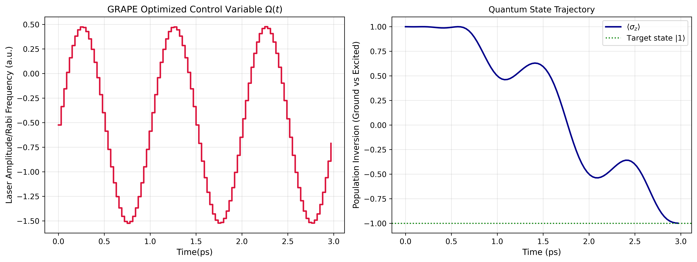
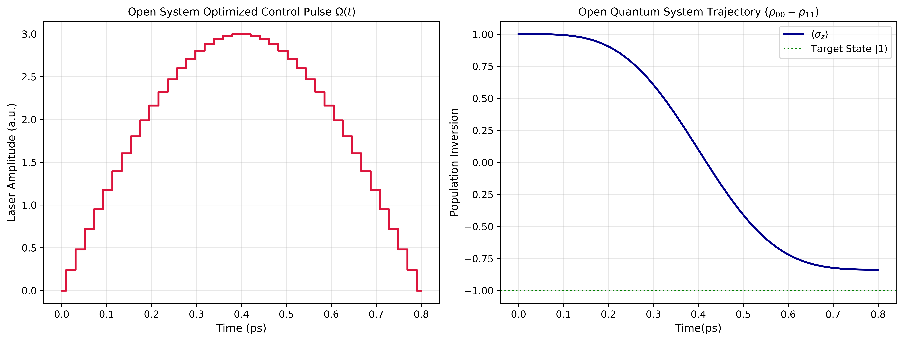

# amo-coherent-control
Numerical routines for the coherent control and pulse optimization of driven, dissipative two-level atomic and molecular system using QuTip.

---

# Coherent Control and Pulse Optimization in Open Two-Level AMO System

This research repository contains numerical implementations of **Quantum Optimal Control Theory (QOCT)** applied to a driven two-level atomic system. We investigate and compare the efficiency of state preparation ($|0\rangle\rightarrow|1\rangle$) using **Gradient Ascent Pulse Engineering (GRAPE)** in a closed system versus gradient-free **BFGS optimization** under an open-system Lindblad master equation framework.

---

## Theoretical Framework & Hamiltonian

We consider a two-level system interacting with a semiclassical, linearly polarized laser field. Under the **Electric Dipole Approximation** and moving into the **Rotating Wave Approximation (RWA)** on resonance, the drift Hamiltonian vanishes ($H_0 = 0$).

The time-dependent interaction Hamiltonian is defined as:

$$H_{\text{init}}(t)=\frac{\hbar}{2}\Omega(t)\sigma_x$$

Where $\Omega(t)$ represents the time-dependent **Rabi frequency** (laser control amplitude), and $\sigma_x$ is the standard Pauli-X operator representing the dipole coupling transition.

### Dissipative Dynamics (Open Quantum System)
To model a realistic AMO laboratory emvironment subject to phase fluctuations, we evolve the density matrix $\rho(t)$ via the **Lindblad Master Equation**:

$$\frac{d\rho}{dt}=-\frac{i}{\hbar}[H_{\text{init}}(t),\rho(t)]+\mathcal{D}[\rho(t)]$$

The dissipator $\mathcal{D}[\rho(t)]$ accounting for pure dephasing at a rate $\gamma_\phi$ is given by:

$$\mathcal{D}[\rho(t)]=\gamma_\phi\left(\sigma_z\rho(t)\sigma_z-\frac{1}{2}\lbrace\sigma_z^2,\rho(t)\rbrace\right)$$

---

## Numerical Simulations & Benchmark Analysis

### 1. Unitary Control via GRAPE [(Closed System OCT)](OCT.py)
In the absence of environmental coupling ($\gamma_\phi=0$), we implement the GRAPE algorithm to discretize the pulse into $N=100$ constant slices over a total duration of $t_f=3.0\text{ ps}$. The system converges tightly to a target fidelity error threshold of $10^{-5}$.

**Terminal Execution Metrics:**
* **Optimization Status**: Successfully Finished
* **Final Success Fidelity**: 1.00000 (Absolute state preparation saturation)

### 2. Robust Control under Pure Dephasing [(Open System OCT)](quantum_open_systm_OCT.py)
When introducing a string Markovian dephasing channel ($\gamma_\phi=0.03$), standard unitary control sequence degrade rapidly due to decoherence. By implementing a Quasi-Newton BFGS optimization scheme directly bound to the Lindblad solver backend, the framework minimizes environmental exposure by squeezing the interaction timescale down to $t_f=0.8\text{ ps}$.

**Terminal Execution Metrics:**
* **Optimization Status**: Finished (Terminated due to optimization precision limits under dissipative noise)
* **Current Function Value**: 0.081257
* **Total Function Evaluations**: 2800
* **Total Gradient Evaluations**: 68
* **Final Lindblad Infidelity Error**: 0.08126 (Corresponding to an open-system target state preparation fidelity of $\approx 91.87\\%$)

---

## Data and Figures

### Figure 1: Closed System GRAPE Dynamics
**Left**: Piecewise-constant optimized Rabi pulse sequence $\Omega(t)$.
**Right**: Corresoponding smooth quantum state trajectory mapped via the expectation value of the population inversion operator $\langle\sigma_z\rangle$.

### Figure 2: Open System Dissipative Dynamics
**Left**: Optimized continuous pulse envelope under active dephasing. **Right**: Open-system trajectory mapping the tracking of the diagonal density elements ($\rho_{00}-\rho_{11}$) illustrating the inevitable tracking floor imposed by Lindbladian noise.

## Physical Interpretation & Discussion

The distinct optimization paths chosen by the two algorithms provide profound insight into the core physics of Quantum Optimal Control Theory (QOCT), specifically highlighting the aggressive competition between coherent driving fields and environmental phase relaxation.

### 1. Navigating the Quantum Speed Limit (QSL)
In the pristine closed-system simulation, the GRAPE algorithm operates without time-dependent entropy constraints ($\gamma_\phi=0$). It takes its time over a long duration ($t_f=3.0\text{ ps}$), calculating exact time-evolution operator gradients to piece together a highly symmetric, smoothly modulated control pulse. Because the system is protected from external noise, it achieves a mathematically perfect population inverrsion saturation ($F=1.00000$) where the target state trajectory perfectly traces the exterior surface of the Bloch sphere.

Conversely, in the open-system simulation, the introduction of a severe Markovian pure dephasing channel ($\gamma_\phi=0.3$) fundamentally alters the control landscape. Because dephasing continuously destroys the essential off-diagonal coherence elements ($\rho_{01}, \rho_{10}$) of the density matrix, the system loses its capacity to be driven effectively on a characteristic coherence timescale of $\tau_\phi\sim1/\gamma_\phi$.

To survive, the BFGS optimizer aggressively drives the system towards the **Quantum Speed Limit (QSL)**. It shortens the total interaction window down to $t_f=0.8\text{ ps}$ - nearly 4 times faster than the closed system. The physics here is intuitive: the algorithm implements a brief, high-amplitude pulse to force the population transfer ($|0\rangle\rightarrow|1\rangle$) as rapidly as possible before the dephasing channel can completely scramble the state's phase profile.

### 2. The Theoretical Decoherence Floor
Despite the extensive optimization over 2800 function evaluations, the open-system solver hits a firm physical bound, stalling at a final Lindblad infidelity error of $0.08126$. This is not a failure of the code or the BFGS algorithm; it represents a hard fundamental limit imposed by open-system quantum mechanics.

Under continuous $\sigma_z$ dephasing, the state trajectory is irreversibly dragged inward, away from the pure-state surface of the Bloch sphere and into a mixed-state density layout. The $\approx 91.87\\%$ fidelity cap achieved represents the absolute thermodynamic and dynamic equilibrium possible - where the constructive power of the coherent driving field ($\sigma_x$) is perfectly balanced against the destructive, irreversible entropy production of the environment.

---

## Conclusion

This project establishes a rigorous computational benchmark analyzing the limits of driven light-matter interactions and coherence preservation across isolated and open atomic systems using QuTip:

* **Coherent Unitary Precision:** In the pristine limit, the GRAPE algorithm demonstrates that exact pulse-shaping can perfectly navigate the system's control landscape. This achieves a $1.00000$ state-preparation fidelity, verifying optimal population inversion pathways when environmental coupling is completely decoupled.
* **Dissipative Dynamics & Dephasing Limits:** Under an active Markovian pure dephasing channel ($\gamma_\phi=0.3$), the open-system BFGS framework successfully maps out the critical trade-offs between pulse duration and rapid phase relaxation. By prioritizing an accelerated interaction timescale near the Quantum Speed Limit, the optimizer preserves a target state fidelity of $\approx91.87\\%$, revealing the absolute bounds of coherent manipulation before environmental noise fully dampens the system's dipole response.

### Alignment with Advanced Spectroscopic Research
The control and optimization routines developed here lay the groundwork for understanding signal degredation in multi-dimensional nonlinear spectroscopy. Because macroscopic polarization decay is driven by the same underlying off-diagonal density matrix relaxation ($\rho_{01}, \rho_{10}$) studied here, these optimization strategies are directly applicable to designing robust pulse sequences that maximize signal-to-noise ratios in transient absorption and four-wave mixing (FWM) experiments.
